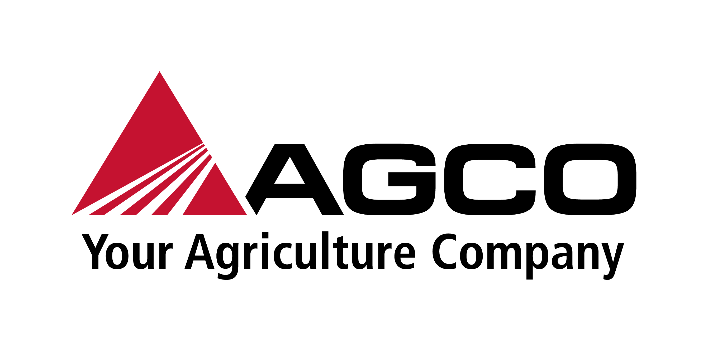
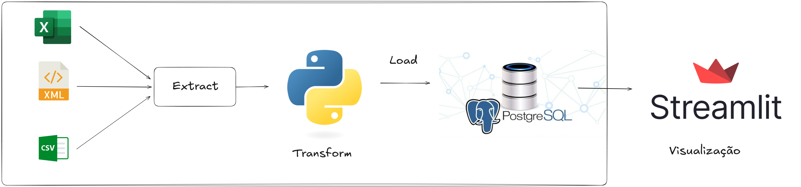
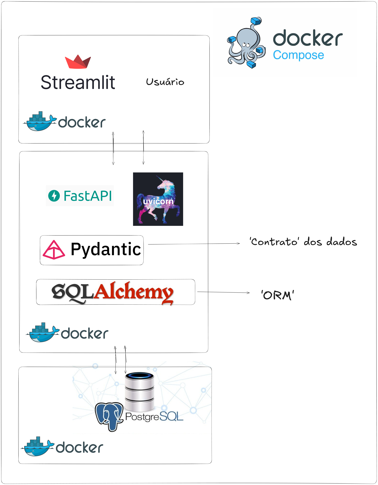

# Projeto AGCO - HUB-IA SENAI

## Sobre o Projeto

Este repositório documenta o desenvolvimento de uma solução que visa identificar e analisar divergências entre diferentes bases de dados, comparando informações provenientes de múltiplos sistemas. O projeto incorpora um pipeline de ETL para processar diversos formatos de arquivos, transformando-os e armazenando-os em um banco de dados PostgreSQL. A solução inclui uma API desenvolvida com FastAPI para facilitar as interações entre frontend e backend, enquanto o frontend, desenvolvido com Streamlit, permite o upload de dados e a visualização de análises diretamente pela interface do usuário.

## Arquitetura do Sistema

- **ETL Pipeline**: Automação da extração, transformação e carregamento de dados de diferentes formatos, que são então inseridos no banco de dados PostgreSQL.
- **FastAPI**: API utilizada para operações CRUD no banco de dados e como intermediária entre o frontend e o backend.
- **Streamlit**: Interface gráfica que possibilita interações com os dados, como o envio de arquivos e a visualização de relatórios de inconsistências.
- **Docker**: Utilizado para garantir consistência no ambiente de desenvolvimento e produção, através da containerização e orquestração dos componentes do sistema.

## Funcionalidades

- **Identificação de Divergências**
- **Verificação de Registros Temporais**: Validação de registros de acordo com critérios de período e vigência, garantindo a conformidade dos dados analisados.
- **Análise Geográfica**: Apresentação de resultados de análises baseadas em critérios geográficos, oferecendo uma visão regional das inconsistências.

## Tecnologias Utilizadas

- **Python**: Linguagem utilizada para o backend e processamento de dados.
- **FastAPI**: Framework para desenvolvimento de APIs de alto desempenho.
- **PostgreSQL**: Sistema de banco de dados relacional para armazenamento e consulta de dados.
- **Streamlit**: Framework de interface gráfica para interações com o sistema e visualização dos dados processados.
- **Docker**: Tecnologia para garantir um ambiente padronizado e facilitar a implantação.
