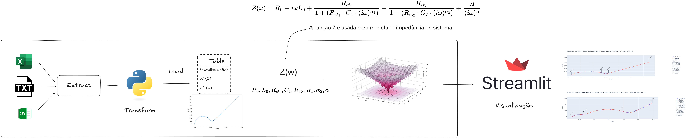

# Otimização de Parâmetros em Modelo de Circuito Equivalente Utilizando Algoritmo de Evolução

## Sobre o Projeto

Este projeto foi desenvolvido para o Instituto SENAI de Tecnologia e Inovação com o objetivo de ajustar os parâmetros de modelos de circuitos equivalentes para que estes se comportem de maneira semelhante aos dados experimentais de Espectroscopia de Impedância Eletroquímica (EIS). Utilizando uma abordagem de otimização, o projeto visa melhorar a acurácia dos modelos simulados ao ajustar seus parâmetros com base em dados reais.

## Objetivos

- Propor uma metodologia eficiente para ajustar os parâmetros de circuitos equivalentes a partir de dados experimentais de EIS.
- Utilizar algoritmos de otimização para encontrar os parâmetros que melhor se ajustem aos dados experimentais.
  
## Escopo

O projeto envolve a modelagem de sistemas eletroquímicos a partir de dados de EIS, utilizando técnicas avançadas de ajuste de parâmetros e otimização para aprimorar os modelos de circuitos equivalentes.

## Tecnologias Utilizadas

- **Análise de Dados**: Python, Pandas, SciPy
- **Algoritmos de Otimização**: Evolução Diferencial
- **Visualização**: Pyplot para geração de gráficos de Nyquist

## Metodologia

### Análise de Dados

Os dados de EIS fornecidos pelo Instituto SENAI foram cuidadosamente pré-processados e analisados para extrair as características relevantes dos sistemas eletroquímicos. Esses dados permitiram a formulação dos modelos de circuito equivalente, utilizados para simular o comportamento dos sistemas.

### Otimização

O algoritmo de Evolução Diferencial foi aplicado para otimizar os parâmetros dos modelos de circuito equivalente. A função de custo foi definida para minimizar o erro entre os valores simulados e os dados experimentais, assegurando que os modelos ajustados refletissem com precisão o comportamento eletroquímico dos sistemas.

### Visualização

Para verificar a precisão dos ajustes, gráficos de Nyquist foram gerados, permitindo uma comparação visual entre os dados experimentais e os dados simulados dos modelos ajustados. Estes gráficos são fundamentais para avaliar a adequação dos modelos otimizados.

## Resultados

Os resultados obtidos demonstraram a eficácia do algoritmo de Evolução Diferencial na otimização dos parâmetros dos circuitos equivalentes, com uma significativa redução no erro entre os dados simulados e experimentais. Através da visualização gráfica dos dados, foi possível validar a acurácia dos modelos.

## Próximos Passos

O próximo passo é explorar a aplicação de redes neurais para a otimização dos parâmetros em futuras iterações, com o objetivo de melhorar ainda mais a precisão dos modelos ajustados.

## Contato

Para mais informações, entre em contato com Pedro Henrique Arias Oliveira.
